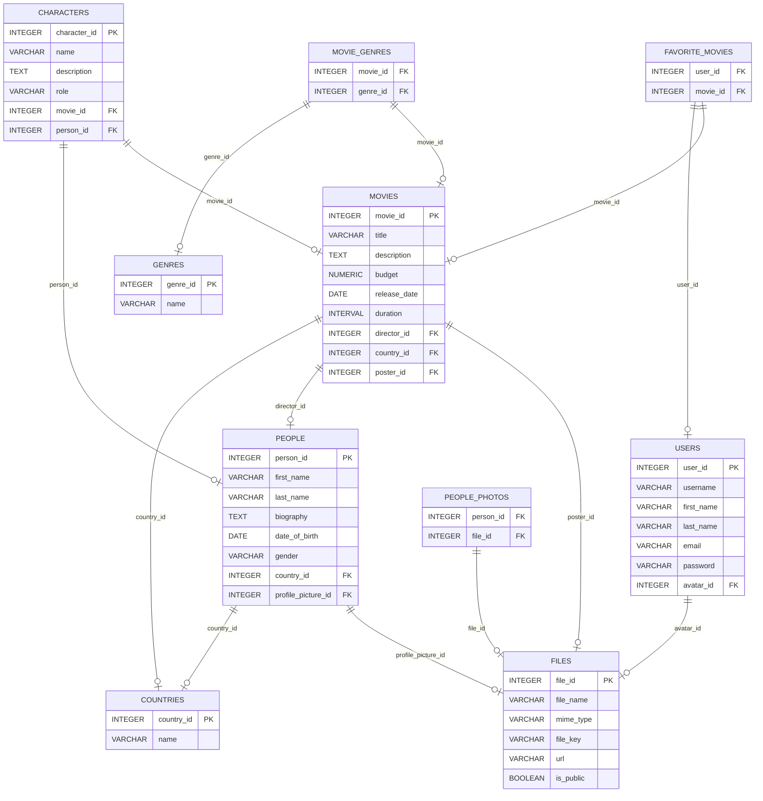

```mermaid
erDiagram
    USERS {
        INTEGER user_id PK
        VARCHAR username
        VARCHAR first_name
        VARCHAR last_name
        VARCHAR email
        VARCHAR password
        INTEGER avatar_id FK
    }

    FILES {
        INTEGER file_id PK
        VARCHAR file_name
        VARCHAR mime_type
        VARCHAR file_key
        VARCHAR url
        BOOLEAN is_public
    }

    MOVIES {
        INTEGER movie_id PK
        VARCHAR title
        TEXT description
        NUMERIC budget
        DATE release_date
        INTERVAL duration
        INTEGER director_id FK
        INTEGER country_id FK
        INTEGER poster_id FK
    }

    GENRES {
        INTEGER genre_id PK
        VARCHAR name
    }

    MOVIE_GENRES {
        INTEGER movie_id FK
        INTEGER genre_id FK
    }

    CHARACTERS {
        INTEGER character_id PK
        VARCHAR name
        TEXT description
        VARCHAR role
        INTEGER movie_id FK
        INTEGER person_id FK
    }

    PEOPLE {
        INTEGER person_id PK
        VARCHAR first_name
        VARCHAR last_name
        TEXT biography
        DATE date_of_birth
        VARCHAR gender
        INTEGER country_id FK
        INTEGER profile_picture_id FK
    }

    PEOPLE_PHOTOS {
        INTEGER person_id FK
        INTEGER file_id FK
    }

    FAVORITE_MOVIES {
        INTEGER user_id FK
        INTEGER movie_id FK
    }

    COUNTRIES {
        INTEGER country_id PK
        VARCHAR name
    }

    %% Relationships
    USERS ||--o| FILES : "avatar_id"
    MOVIES ||--o| FILES : "poster_id"
    MOVIES ||--o| PEOPLE : "director_id"
    MOVIES ||--o| COUNTRIES : "country_id"
    MOVIE_GENRES ||--o| MOVIES : "movie_id"
    MOVIE_GENRES ||--o| GENRES : "genre_id"
    CHARACTERS ||--o| MOVIES : "movie_id"
    CHARACTERS ||--o| PEOPLE : "person_id"
    PEOPLE ||--o| FILES : "profile_picture_id"
    PEOPLE ||--o| COUNTRIES : "country_id"
    PEOPLE_PHOTOS ||--o| FILES : "file_id"
    FAVORITE_MOVIES ||--o| MOVIES : "movie_id"
    FAVORITE_MOVIES ||--o| USERS : "user_id"

```
